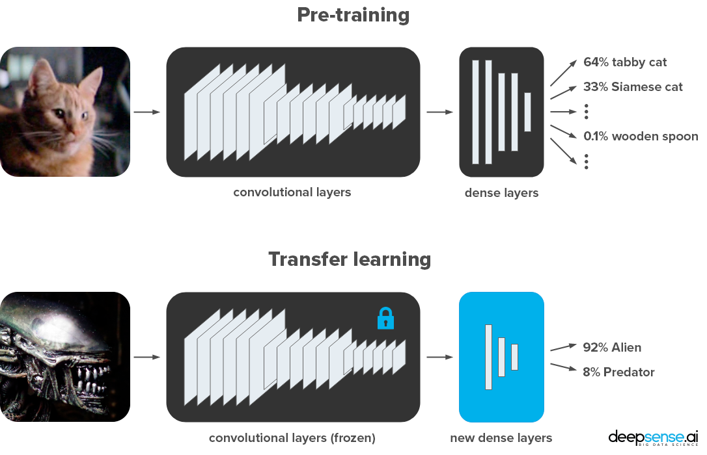
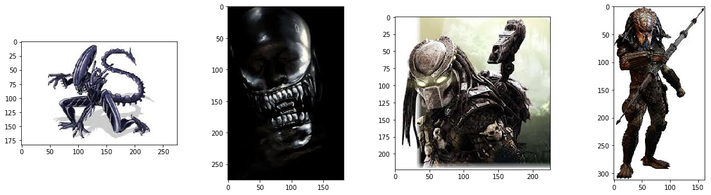

_Originalmente extraído do excelente do blog [deepsense.ai](https://deepsense.ai/) [post](https://medium.freecodecamp.org/keras-vs-pytorch-avp-transfer-learning-c8b852c31f02) no Medium e com código de fonte originalmente no [GitHub](https://github.com/deepsense-ai/Keras-PyTorch-AvP-transfer-learning).
As notas e demais alterações tem o intuito somente de traduzir e adaptar para a realidade das aulas do curso de Inteligência Artificial da FIAP, na disciplina de Tecnologia e Processamento de Imagens_

# Utilizando _transfer learning_ para classificação de Aliens e Predadores

Utilizando a técnica de _transfer learning_ obtivemos a vantagem de utilizar um modelo em deep-learning especializado na detecção de objetos, pessoas e animais, para aplicá-lo para outro conjunto de imagens que podem ter suas características extraídas pela mesma rede utilizada, que já se encontra otimizada para um conjunto de dados muito maior e preparada para uma variedade de discriminadores disponíveis.

O notebook abaixo foi utilizado para demonstrar este tipo de técnica:

* [Transfer learning com pesos pré-teinados ResNet-50 utilizando Keras](transfer-learning-keras.ipynb)

# Dados

As imagens foram obtidas do desafio[Alien vs. Predator images | Kaggle](https://www.kaggle.com/pmigdal/alien-vs-predator-images).
No geral, foram utilizadas 447 imagens para cada classe, sendo dividida em duas classes (_alien_ e _predador_):

# Requisitos

* Comum:
  * jupyter==1.0.0
  * matplotlib==2.2.3
  * Pillow==5.2.0
  * h5py==2.8.0
* Keras:
  * tensorflow==1.10.1
  * Keras==2.2.2
